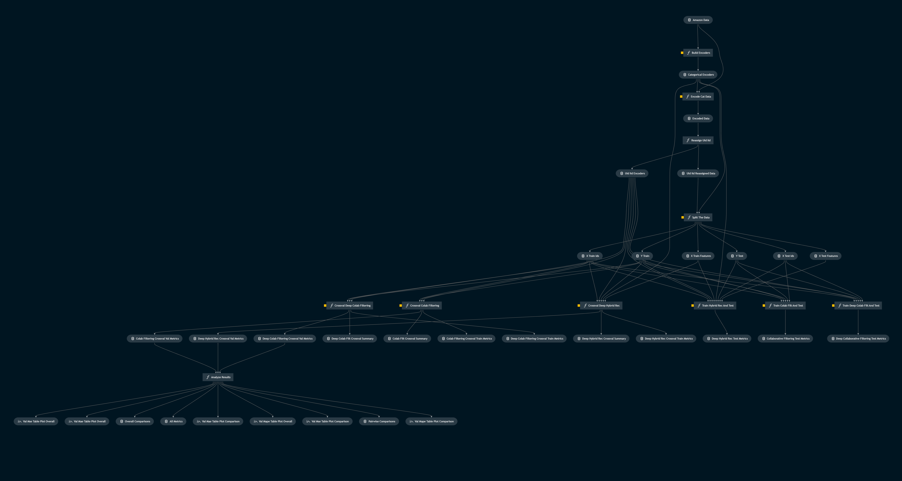

# Deep Hybrid Recommenders


## Overview

# Intro

This software project serves as supplementary material to the publication 

> Wójcik, F., & Górnik, M. (2020). **Improvement of e-commerce recommendation systems with deep hybrid collaborative filtering with content: A case study.** Econometrics. Ekonometria. Advances in Applied Data Analytics, 24(3), 37-50.

1. The paper can be found [here](https://sciendo.com/it/article/10.15611/eada.2020.3.03).
2. Papers with code reference [here](https://paperswithcode.com/paper/improvement-of-e-commerce-recommendation)
[](https://paperswithcode.com/sota/recommendation-systems-on-amazon-beauty?p=improvement-of-e-commerce-recommendation)

Structured as a software project rather than just a series of notebooks, **this project highlights the importance of organizing machine learning projects**. The use of **PyTorch and PyTorch Lightning** allows for easy experimentation and scaling, making it an ideal choice for building complex deep-learning models. Automating data processing pipelines simplifies the entire process and ensures that the model can be easily updated with new data.

This project offers a valuable resource for researchers and practitioners looking to connect theoretical approaches with practical implementation by providing a working implementation of the models discussed in the paper and reproducible experiment pipelines.

This is your new Kedro project, which was generated using `Kedro 0.18.4`.
Take a look at the [Kedro documentation](https://kedro.readthedocs.io) to get started.

Author's official profiles can be found below:
1. [Michał Górnik](https://www.linkedin.com/in/mgornik/)
2. [Filip Wójcik](https://pl.linkedin.com/in/machinelearningspecialist), [official webiste](https://filip-wojcik.com/)

# The data

The performance of the aforementioned algorithms was evaluated using the realworld dataset, containing customer reviews: “Amazon 2018 Reviews Dataset” which is an updated version of the previous edition 
of "Amazon Reviews Dataset" (R. He and McAuley, 2016; McAuley, Targett, Shi,
and Van Den Hengel, 2015).

The official website of the dataset can be found [here](https://nijianmo.github.io/amazon/index.html).

In order to properly process the data using pipelines:
1. Open the official dataset website.
2. Go to the category of research/small datasets and choose "All Beauty" data ([direct link](https://jmcauley.ucsd.edu/data/amazon_v2/categoryFilesSmall/All_Beauty_5.json.gz))
3. Accept any terms and conditions
4. Download the data 
5. Extract the `.json` file and save to the folder `/data/01_raw/`

To cite the original paper and research related to the Amazon Dataset:
> **Justifying recommendations using distantly-labeled reviews and fined-grained aspects**,
Jianmo Ni, Jiacheng Li, Julian McAuley
Empirical Methods in Natural Language Processing (EMNLP), 2019

# Experimental results

The experimental results are summarized in notebook `notebooks/experiment_summary.ipynb`.
Notebook is also available as a static HTML file `notebooks/experiment_summary.html`.

The experimental procedure was the same for all models:
1. The data was split into train, validation and test sets.
2. Each model type was cross-validated 10 times, and validation metrics were saved for further analsysis.
3. Then each model was trained on a full train dataset and evaluated on the test set.
4. Validation results of each model were compared using:
   1. The non-parametric **Kruskal-Wallis test** - to assess the overall difference in the performance of the models.
   2. **Using pairwise post-hoc tests** between all models, with the Bonferroni correction for multiple comparisons.

**The post-hoc test results show that the Hybrid Recommender model is significantly better than the other two models in all cases**
with large effect sizes on all metrics (MAPE/MSE/MAE).

# The pipeline

The pipeline is divided into 3 main parts:
1. **Data preparation**:
   1. Extraction of the data from the `.json` file
   2. Processing categorical data - extraction from the text and encoding
   3. Encoding user and item IDs - as consecutive integers starting from 0
2. **Experiment preparation** - repeatable splitting the data into train, validation and test sets
3. **Experiment execution** - training and evaluation of the models, saving results.

The Kedro picture below presents the pipeline step by step:




# Future work

The project is still in development and new experiments will be a part of future research publications.

The future work on **Deep Hybrid Recommender** will focus primarily on **including the graph neural networks** as recommendation models, 
as their usability and applicability to the e-commerce domain have been proven. 

GNNs for **heterogeneous domains** (graphs with varied node types) are a relatively new and extensively researched topic with promising results.

> Gao, C., Zheng, Y., Li, N., Li, Y., Qin, Y., Piao, J., ... & Li, Y. (2021). Graph neural networks for recommender systems: Challenges, methods, and directions. arXiv preprint arXiv:2109.12843.

> Wu, S., Sun, F., Zhang, W., Xie, X., & Cui, B. (2022). Graph neural networks in recommender systems: a survey. ACM Computing Surveys, 55(5), 1-37

## How to install dependencies

Declare any dependencies in `src/requirements.txt` for `pip` installation and `src/environment.yml` for `conda` installation.

To install them, run:

```
pip install -r src/requirements.txt
```

## How to run Kedro pipeline

You can run your Kedro project with:

```
kedro run
```

To run specific pipeline node, execute:

```
kedro run --nodes NODE
```
## How to visualize the pipeline

You can visualize your Kedro pipeline with:

```
kedro viz
```

from the main project directory. This will open a browser window with the interactive visualization of your pipeline.

You can interact with the pipeline itself or open the experiment tracking dashboard to seed details of the runs.

## How to work with Kedro and notebooks

> Note: Using `kedro jupyter` or `kedro ipython` to run your notebook provides these variables in scope: `context`, `catalog`, and `startup_error`.
>
> Jupyter, JupyterLab, and IPython are already included in the project requirements by default, so once you have run `pip install -r src/requirements.txt` you will not need to take any extra steps before you use them.

### Jupyter

To use Jupyter notebooks in your Kedro project, you need to install Jupyter:

```
pip install jupyter
```

After installing Jupyter, you can start a local notebook server:

```
kedro jupyter notebook
```

### JupyterLab
To use JupyterLab, you need to install it:

```
pip install jupyterlab
```

You can also start JupyterLab:

```
kedro jupyter lab
```

# Additional citations

> McAuley, J., Targett, C., Shi, Q., and Van Den Hengel, A. (2015). Image-based recommendations on styles and substitutes. SIGIR 2015 -Proceedings of the 38th International ACM SIGIR Conference on Research and Development in Information Retrieval.

> He, R., and McAuley, J. (2016). Ups and downs: Modeling the visual evolution of fashion trends with one-class collaborative filtering. In 25th International World Wide Web Conference, WWW 2016.
